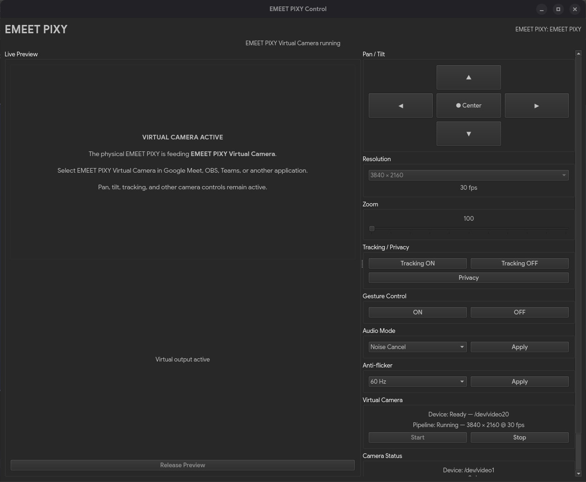

# EMEET PIXY Control for Linux

Unofficial native Linux control panel for the **EMEET PIXY** webcam (`328f:00c0`).

This project provides a PySide6 desktop GUI for PTZ controls, tracking/privacy modes, gesture control, audio modes, anti-flicker, live preview, resolution selection, persistence, direct camera release for conferencing apps, and an optional `v4l2loopback` virtual camera.

> **Unofficial community project.** Not affiliated with or endorsed by EMEET. EMEET and PIXY are trademarks of their respective owner.

## Status

**Alpha / hardware-specific.** Tested with the EMEET PIXY on CachyOS (Arch-based). Contributions and reports from other distributions are welcome.

## Screenshots

### Live preview and resolution selection


### Release Preview

Release the physical camera stream so Google Meet, OBS, Teams, or another application can use the PIXY directly while PTZ/HID controls remain available.


### Virtual Camera

The optional FFmpeg + `v4l2loopback` pipeline republishes the PIXY as **EMEET PIXY Virtual Camera**.



Tested setup (August 2026):

- EMEET PIXY USB ID: `328f:00c0`
- CachyOS kernel: `7.2.0-1-cachyos`
- Python: `3.14.7`
- PySide6: `6.11.2`
- `v4l2-ctl`: `1.32.0`
- `v4l2loopback`: `0.15.4`
- FFmpeg: `9.0.1`

## Features

- Native Qt/PySide6 desktop application
- Live camera preview
- Pan / tilt with press-and-hold movement
- Center camera
- Resolution selector populated from the camera itself
- Native PIXY zoom where supported by the active mode
- Face tracking on/off
- Privacy mode
- Gesture control on/off
- Audio mode: Noise Cancel / Live / Original
- 50 Hz / 60 Hz anti-flicker
- Saved pan, tilt, zoom, resolution and mode settings
- **Release Preview** mode so Google Meet, OBS, Teams, etc. can open the physical camera directly
- **Virtual Camera** mode using FFmpeg + `v4l2loopback`
- Persistent virtual camera device created by systemd
- Dynamic discovery of physical and virtual `/dev/video*` nodes
- HID permissions handled by a targeted udev rule

## Release Preview vs Virtual Camera

Linux applications often cannot simultaneously open the same physical webcam stream.

### Release Preview

Use **Release Preview** when you want Google Meet, OBS, Teams, or another application to use the physical PIXY directly. The GUI releases the video stream but keeps PTZ/HID controls available.

### Virtual Camera

Use **Virtual Camera** when you want the PIXY stream republished through `v4l2loopback` as **EMEET PIXY Virtual Camera**. The GUI starts and stops the FFmpeg bridge; the virtual device itself is created persistently at boot.

The service prefers `/dev/video20` but will choose another free device from `/dev/video20` through `/dev/video29`. The GUI discovers it by name, so it does not depend on a fixed device number.

## Zoom behavior

On the tested PIXY, native `zoom_absolute` works at modes below `1920x1080`. It did not visibly apply at `1920x1080` or higher in the tested Qt modes, even though V4L2 accepted and reported the zoom value. The GUI therefore disables the zoom slider at widths of 1920 pixels or greater.

This may vary with firmware or exact video mode. Reports are welcome.

## Requirements

Runtime commands:

- Python 3.10+
- `v4l2-ctl` (`v4l-utils`)
- FFmpeg
- `v4l2loopback-ctl`
- `v4l2loopback` kernel module
- systemd (for the persistent virtual-camera service installed by `install.sh`)

The installer creates a private Python virtual environment and installs PySide6 there.

### CachyOS / Arch Linux

```bash
sudo pacman -S --needed python python-pip v4l-utils ffmpeg v4l2loopback-utils
```

On vanilla Arch, `v4l2loopback-utils` normally uses the `v4l2loopback-dkms` module provider. Install the matching kernel headers if required (for example `linux-headers` for the standard Arch kernel).

CachyOS kernels may already provide the module directly.

### Debian / Ubuntu

Untested, but the expected prerequisites are:

```bash
sudo apt install python3 python3-venv v4l-utils ffmpeg \
  v4l2loopback-utils v4l2loopback-dkms linux-headers-$(uname -r)
```

Please open an issue or PR with corrections for your distribution.

## Install

```bash
git clone https://github.com/rolfobermaier/emeet-pixy-control.git
cd emeet-pixy-control
./install.sh
```

The installer:

1. creates `~/.local/share/emeet-pixy-control/venv`;
2. installs this project and PySide6 into that venv;
3. installs the desktop launcher and icon under `~/.local/share`;
4. installs a PIXY-only udev rule for HID access;
5. installs and enables the persistent virtual-camera systemd service;
6. adds the user to the `video` group if necessary.

After installation, launch **EMEET PIXY Control** from your application menu.

If advanced HID controls are denied immediately after installation, unplug/replug the PIXY once or log out and back in.

## CLI

The installation also provides a small command-line backend:

```bash
~/.local/share/emeet-pixy-control/venv/bin/emeet-pixy-cli status
~/.local/share/emeet-pixy-control/venv/bin/emeet-pixy-cli center
~/.local/share/emeet-pixy-control/venv/bin/emeet-pixy-cli track
~/.local/share/emeet-pixy-control/venv/bin/emeet-pixy-cli idle
~/.local/share/emeet-pixy-control/venv/bin/emeet-pixy-cli privacy
```

## Virtual camera service

Check status:

```bash
systemctl status emeet-pixy-virtual-camera.service
```

List video devices:

```bash
v4l2-ctl --list-devices
```

A healthy setup should include an entry named:

```text
EMEET PIXY Virtual Camera
```

### Rolling-release kernel updates

If a kernel update has installed a new kernel while the old one is still running, `modprobe v4l2loopback` can fail because the old `/lib/modules/<kernel>` tree has already been removed. Reboot into the newly installed kernel before troubleshooting the virtual-camera service.

## Uninstall

```bash
./uninstall.sh
```

Keep saved settings by default. To remove them too:

```bash
./uninstall.sh --purge
```

The script intentionally does **not** remove system packages such as FFmpeg or `v4l2loopback`.

## Troubleshooting

### Camera is not visible in Meet/OBS while the GUI preview is running

Click **Release Preview**, then select the physical EMEET PIXY in the conferencing/recording application.

Or start **Virtual Camera** and select **EMEET PIXY Virtual Camera** instead.

### `Permission denied` on `/dev/hidraw*`

Verify the supplied udev rule is installed:

```bash
cat /etc/udev/rules.d/70-emeet-pixy.rules
```

Then reconnect the camera.

### Virtual Camera says Device Missing

Check:

```bash
systemctl status emeet-pixy-virtual-camera.service
v4l2-ctl --list-devices
```

### `modprobe: Module v4l2loopback not found`

Install the module for your kernel (and matching headers if using DKMS). On rolling distributions, also check whether you need to reboot into the newly installed kernel.

### Qt/FFmpeg mentions `libvdpau_nvidia.so` on a non-NVIDIA system

Qt/FFmpeg may probe optional acceleration backends. If the preview works, this warning is generally harmless.

## Security / permissions

The udev rule is deliberately restricted to USB vendor/product ID `328f:00c0`; it does **not** make every `/dev/hidraw*` device writable.

The virtual-camera control device remains root-managed through systemd. The desktop GUI only writes video frames to the resulting V4L2 device.

## Project layout

```text
src/emeet_pixy_control/
  gui.py                 Qt desktop application
  backend.py             UVC/HID control backend + CLI
  assets/
    emeet-pixy-control.svg

deploy/
  70-emeet-pixy.rules
  emeet-pixy-control.desktop.in
  emeet-pixy-virtual-camera.service
  virtual-camera-device

install.sh
uninstall.sh
```

## Protocol provenance and credits

The EMEET PIXY's proprietary HID behavior was publicly reverse-engineered by Linux users before this application was written. This repository contains an independently written implementation of those protocol facts. See [CREDITS.md](CREDITS.md).

## License

Code: **GNU GPL v3 only**. See [LICENSE](LICENSE).

The application icon is based on a CC0 camera vector from SVG Repo and was modified for this project. See [CREDITS.md](CREDITS.md).
